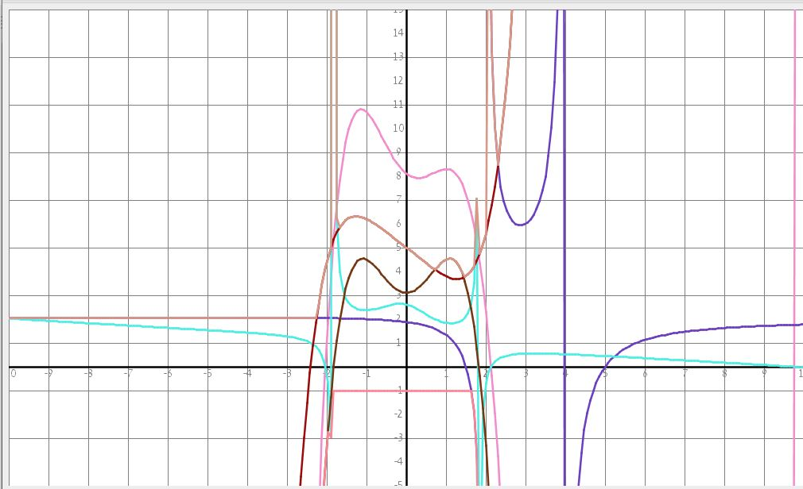

# Desmos
This program represent group of functions such as Monom,Polynom and Complex function,And let the user build this functions and draw them by using Java StDraw libary, This program lets you use mathematical opreations on this functions such as add,mult...


#                                             Monom :
 This class represents a monom in the form of ax^b where a is a real number and b is a natural number.
```	
Example:	
f(x)=x^5,f(x)=27,...	
```
                                

# polynom :
This class represents a polynom which compose of monoms.
```	
Example:	
f(x)=x^5+x^4+34....	
```


 # ComplexFunctions:
This class represents complex function that can be composed of Monom,Polynom, and ComplexFunction.

```
Example
                       
                                                         div
		 *                           mul                            max
		 * 						       22x^3      53
		 *                  min               plus
		 *            3x^3       46      x^2       x^7   
   
   
```                      
       
   
  

Each function supprorts the follwoing methods:	

  F(int x): 	
  ```  	
 That method lets you compute the value of the function at the given value of X	
 ```  	

initFromString(String s):	
 ``` 	
 This Method lets you recieve string and covert it into Polynom,monom or Complexfunction	
  ``` 	
  copy()	
  ``` 	
  This Method lets you preform deep copy semantic and return a new function exactly like the one you send.	
  ``` 	
  equals(Object obj)	
  ``` 	
  The equals method vary from function to function , if you use this method on objects such as Monom and Polynom it should not	
  be a problem, but if you use this method on complexfunction it samples the method f from -1 to 1 in jumps of 0.00001 	
  and checks to see if all the values between hem are equals	
  ``` 
